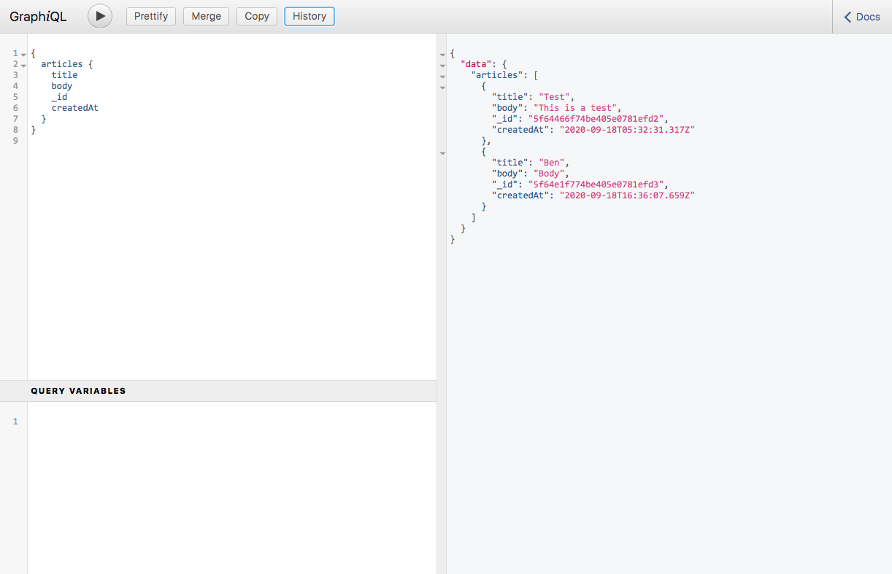

# GraphQL API

Simple project where i built a GraphQl API from scratch with Node JS, Express, and MongoDB. When built i used GraphiQL to send some create and query some simple articles.

# 

## Table of contents

1. [Demo](#demo)
2. [Technologies](#technologies)
3. [Features](#features)
4. [Development](#development)
5. [License](#license)

## Demo

To view this in action simply fork/clone the project then `npm install` all dependencies, after that `npm start` then head to http://localhost:3000/graphql

## Technologies

- TypeScript, ES6+,
- GraphQL
- MongoDB w/ Mongoose

## Features

- Simple GraphQL to create and query data

### Development

- Further learning with GraphQL
- Implement into real project

## License

> You can check out the full license [here](LICENSE)

This project is licensed under the terms of the **MIT** license.
